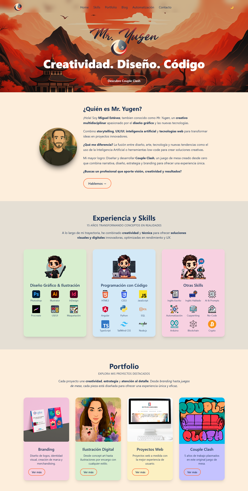
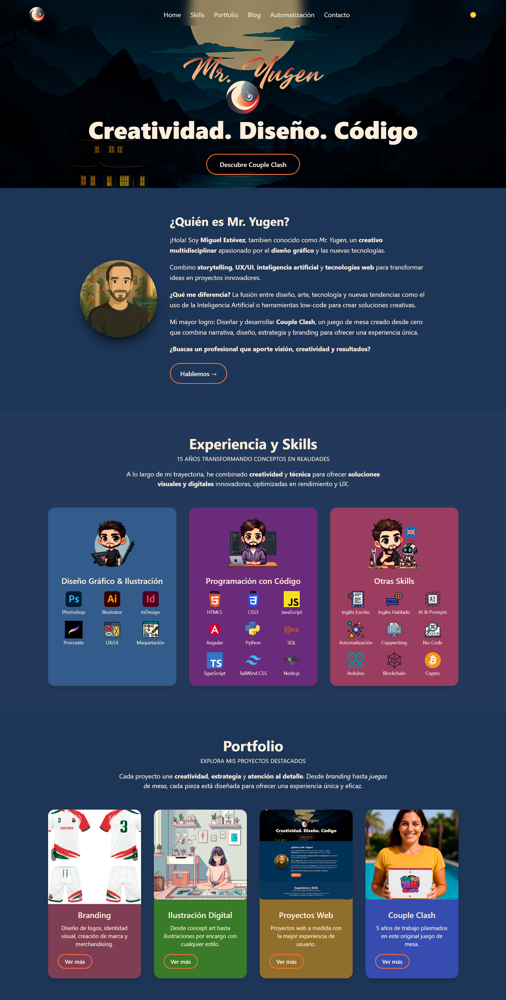

# 🧩 Mr. Yugen Web

**Mr. Yugen Web** es el portafolio y sitio personal de **Miguel Estévez** (_Mr. Yugen_): diseñador gráfico, ilustrador y desarrollador web. Aquí encontrarás:

- 🎨 Mi CV digital y sección “Sobre mí”  
- ⚙️ Servicios de automatización  
- 🖼️ Portfolio de **Branding**, Ilustración, Proyectos Web y **Couple Clash**  
- 📝 Blog con tutoriales y reflexiones  
- 📬 Formulario de contacto

---

## 📋 Tabla de Contenidos

- [🧩 Mr. Yugen Web](#-mr-yugen-web)
  - [📋 Tabla de Contenidos](#-tabla-de-contenidos)
  - [🎥 Demo](#-demo)
  - [✨ Características](#-características)
  - [🛠 Tecnologías](#-tecnologías)
  - [📂 Estructura del Proyecto](#-estructura-del-proyecto)
  - [🚀 Instalación y Desarrollo](#-instalación-y-desarrollo)
  - [🔧 Problemas Conocidos](#-problemas-conocidos)
  - [🤝 Contribución](#-contribución)
  - [📄 Licencia](#-licencia)
  - [✍️ Autor y Contacto](#️-autor-y-contacto)

---

## 🎥 Demo

<p align="center">
    
  
  
    
</p>

---

## ✨ Características

- **Routing SPA** con Angular 17 y `provideRouter` + scroll restoration.  
- **Modo Claro/Oscuro** persistente (ThemeService + CSS variables).  
- **Animaciones** suaves con GSAP y Framer Motion.  
- **Responsive** 100%: menú desktop/tablet/mobile.  
- **Accesibilidad**: semántica HTML, atributos ARIA, tamaños adecuados.  
- **Lazy loading** de imágenes y optimización de rendimiento.

---

## 🛠 Tecnologías

- **Framework**: Angular 17 + TypeScript  
- **Estilos**: Tailwind CSS (darkMode por clase)  
- **Animaciones**: GSAP, Framer Motion  
- **Test**: Jasmine + Karma  
- **Herramientas**: VS Code, Git, GitHub  

---

## 📂 Estructura del Proyecto

```text``

src/
├─ app/
│  ├─ home/                ← Landing page
│  ├─ portfolio-branding/  ← Branding (hero, proceso, masonry)
│  ├─ navbar/, hero/, footer/, scroll-to-top/
│  ├─ services/theme.service.ts
│  ├─ app.routes.ts
│  └─ app.config.ts        ← scrollPositionRestoration
├─ assets/
│  └─ images/…
├─ docs/
│  └─ screenshots/
└─ styles.css
Secciones implementadas

Home → Hero, Sobre mí, Skills, Portfolio preview, Blog, Automatización, Contacto

Branding → Hero, Proceso paso a paso, Masonry de proyectos destacados

## 🚀 Instalación y Desarrollo

- **Clona este repositorio**

`git clone https://github.com/MrYugen/mryugenweb.git`
`cd mryugenweb`

- **Instala dependencias**

`npm install`

- **Lanza el servidor de desarrollo**

`npm start`

- **Abre:**  `http://localhost:4200`

## 🔧 Problemas Conocidos


## 🤝 Contribución

- **Haz un fork del repositorio.**

- **Crea una rama de feature:**

`git checkout -b feature/mi-nueva-funcionalidad`

- **Realiza tus cambios y commitea:**

`git commit -m "feat: Descripción breve"`

- **Push y abre un Pull Request.**

## 📄 Licencia

Este proyecto está bajo Creative Commons BY-NC-SA 4.0.

Puedes compartir y adaptar bajo:

Atribución a **Miguel Estévez - Mr. Yugen**

Sin uso comercial

Compartir bajo la misma licencia

## ✍️ Autor y Contacto

**Miguel Estévez (Mr. Yugen)**

**GitHub:** @MrYugen

**Email:** mryugenmystery@gmail.com

¡Gracias por pasar por aquí! Espero que este README sirva de punto de partida claro y ayude a cualquiera que quiera colaborar.