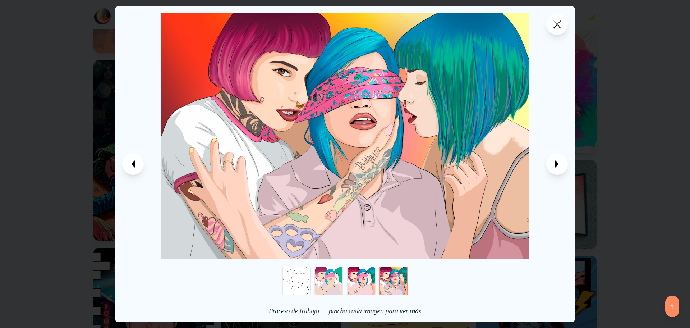

# Mr. Yugen Web

Portafolio y sitio personal de Miguel Estévez (Mr. Yugen): diseño gráfico, ilustración y desarrollo web con foco en experiencia de usuario, rendimiento y accesibilidad. Aquí encontrarás:

- Mi CV y sección “Sobre mí”
- Servicios de automatización de procesos e IA aplicada
- Portfolio de Branding, Ilustración y Proyectos Web (incluye Couple Clash)
- Blog con artículos, tutoriales y reflexiones
- Formulario de contacto y textos legales

—

## Tabla de Contenidos

- [Mr. Yugen Web](#mr-yugen-web)
  - [Tabla de Contenidos](#tabla-de-contenidos)
  - [Visión General](#visión-general)
  - [Capturas](#capturas)
  - [Características](#características)
  - [Tecnologías](#tecnologías)
  - [Estructura](#estructura)
  - [Rutas Principales](#rutas-principales)
  - [Instalación y Desarrollo](#instalación-y-desarrollo)
  - [Pruebas](#pruebas)
  - [Despliegue](#despliegue)
  - [Problemas Conocidos](#problemas-conocidos)
  - [Contribución](#contribución)
  - [Licencia](#licencia)
  - [Autor y Contacto](#autor-y-contacto)

—

## Visión General

Proyecto SPA en Angular 17 que centraliza mi trabajo creativo y técnico. El sitio utiliza componentes standalone, enrutado con restauración de scroll, modo claro/oscuro persistente y animaciones con GSAP/ScrollTrigger. El contenido está optimizado para rendimiento (lazy‑loading de imágenes) y SEO (metadatos y JSON‑LD). Algunas secciones, como la página dedicada a Couple Clash, están en desarrollo.

Dominio oficial previsto: https://mryugen.com

—

## Capturas

<p align="center">
  
  
  
  
  
  
  
  
  
  
  
  
</p>

—

## Características

- Enrutado SPA con `provideRouter` y `withInMemoryScrolling` (scroll al top y soporte de anclas).
- Modo claro/oscuro persistente vía `ThemeService` + variables CSS (Tailwind `darkMode: 'class'`).
- Animaciones fluidas con GSAP y ScrollTrigger; micro‑interacciones en cards, sliders y secciones.
- Respeta `prefers-reduced-motion`: detecta la preferencia del usuario y desactiva/paraliza animaciones pesadas de GSAP cuando se solicita.
- Responsive 100% en desktop/tablet/móvil.
- Accesibilidad: HTML semántico, labels y alt, focus states y tamaños legibles.
- Rendimiento: imágenes `loading="lazy"`, CSS utilitario y uso de assets optimizados.

—

## Tecnologías

- Framework: Angular 17 (Standalone Components) + TypeScript
- Estilos: Tailwind CSS (tema por variables CSS y clase `dark`)
- Animaciones: GSAP + ScrollTrigger
- Tests: Jasmine + Karma (con Chrome Headless opcional)
- Herramientas: Angular CLI, VS Code, Git/GitHub

—

## Estructura

```
src/
  app/
    home/                 # Landing: Hero, Sobre mí, Skills, Portfolio, Blog, Automatización, Contacto
    portfolio-branding/   # Proceso y proyectos de branding (masonry + slider)
    portfolio-web/        # Proceso y proyectos de web (masonry + slider)
    ilustraciones/        # Galería de ilustraciones (con lightbox)
    project-details/      # Detalles de proyecto de branding (incluye before/after slider)
    project-web-details/  # Detalles de proyecto web
    automatizacion-page/  # Página de servicios de automatización e IA
    legal/                # Aviso legal, Privacidad, Cookies, Condiciones, Buenas prácticas
    under-construction/   # Página temporal para contenido en desarrollo
    navbar/, hero/, footer/, scroll-to-top/
    services/
      theme.service.ts    # Persistencia de modo oscuro
      blog.service.ts     # Datos del blog (WIP)
    app.routes.ts         # Rutas principales
    app.config.ts         # Router + scroll restoration
  assets/                 # Imágenes y recursos
  docs/screenshots/       # Capturas usadas en el README
  styles.css              # Variables y estilos globales
```

—

## Rutas Principales

- `/` Home
- `/blog` y `/blog/:slug`
- `/portfolio/branding` y `/portfolio/branding/:slug`
- `/portfolio/illustration`
- `/portfolio/web` y `/portfolio/web/:slug`
- `/automation`
- `/under-construction`
- Textos legales: `/aviso-legal`, `/politica-privacidad`, `/politica-cookies`, `/condiciones-generales`, `/buenas-practicas-tecnicas`

—

## Instalación y Desarrollo

Requisitos: Node.js 18+ y npm.

1) Clona el repositorio

```
git clone https://github.com/MrYugen/mryugenweb.git
cd mryugenweb
```

2) Instala dependencias

```
npm install
```

3) Entorno de desarrollo

```
npm start
```

Abre `http://localhost:4200`.

—

## Pruebas

- Ejecutar tests en navegador

```
npm test
```

- Ejecutar en headless (requiere Google Chrome)

```
npm run test:ia
```

Nota: en CI (p. ej. GitHub Actions) suele estar disponible Chrome.

—

## Despliegue

Genera build de producción en `dist/`:

```
npm run build
```

El resultado es una app SPA estática que puedes servir con Nginx, Apache o un hosting estático (Netlify, Vercel, etc.). Configura el rewrite de SPA para redirigir rutas al `index.html`.

—

## Problemas Conocidos

- Algunas secciones y entradas del blog están en evolución activa.
- La página dedicada a Couple Clash está marcada como “En construcción”.
- Problemas menores con la visualización de la web en algunos dispositivos móviles.

Si encuentras un bug, abre un issue con pasos para reproducirlo.

—

## Contribución

1) Haz fork del repositorio

2) Crea una rama de feature

```
git checkout -b feature/mi-nueva-funcionalidad
```

3) Realiza tus cambios y commitea

```
git commit -m "feat: descripción breve"
```

4) Haz push y abre un Pull Request

—

## Licencia

Creative Commons BY‑NC‑SA 4.0.

Puedes compartir y adaptar bajo las condiciones:

- Atribución a Miguel Estévez – Mr. Yugen
- Sin uso comercial
- Compartir bajo la misma licencia

Más info: https://creativecommons.org/licenses/by-nc-sa/4.0/deed.es

—

## Autor y Contacto

**Miguel Estévez (Mr. Yugen)**

- GitHub: @MrYugen
- Email: [mryugenmystery@gmail.com](mailto:mryugenmystery@gmail.com)

Gracias por pasarte. Espero que este README te ayude a entender el proyecto y a contribuir si te apetece.

